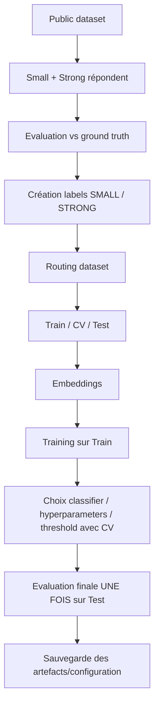
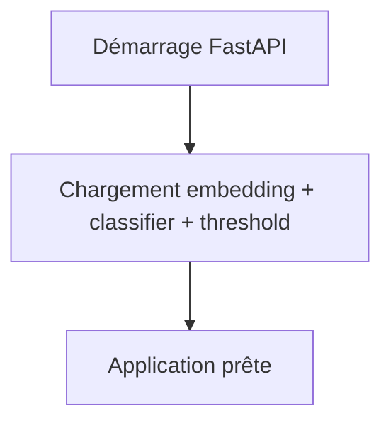
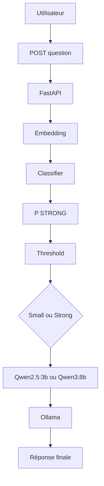

## Pipeline OFFLINE

```mermaid
flowchart TD
    A[Public dataset] --> B[Small + Strong répondent]
    B --> C[Evaluation vs ground truth]
    C --> D[Création labels SMALL / STRONG]
    D --> E[Routing dataset]
    E --> F[Train / CV / Test]
    F --> G[Embeddings]
    G --> H[Training sur Train]
    H --> I[Choix classifier / hyperparameters / threshold avec CV]
    I --> J[Evaluation finale UNE FOIS sur Test]
    J --> K[Sauvegarde des artefacts/configuration]
```

## Démarrage de l'application

```mermaid
flowchart TD
    A[Démarrage FastAPI] --> B[Chargement embedding + classifier + threshold]
    B --> C[Application prête]
```

## Pipeline ONLINE

```mermaid
flowchart TD
    A[Utilisateur] --> B[POST question]
    B --> C[FastAPI]
    C --> D[Embedding]
    D --> E[Classifier]
    E --> F[P STRONG]
    F --> G[Threshold]
    G --> H{Small ou Strong}
    H --> I[Qwen2.5:3b ou Qwen3:8b]
    I --> J[Ollama]
    J --> K[Réponse finale]
```

